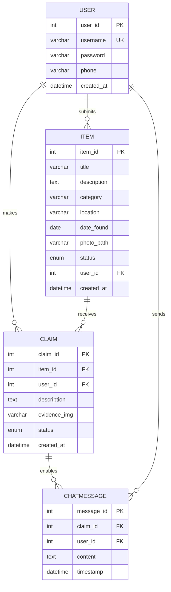

# Where's My Pie? 🥧
A simple and accessible lost and found system for everyone

**Development Team: TreeNoPie**

## 📖 Project Overview

Where's My Pie? is a lost and found system designed for campus communities. It facilitates the process of reporting found items and claiming lost belongings through a two-way verification mechanism.

### 🎯 Core Features
- User account management with secure authentication
- Found item reporting with photo upload
- Advanced item search and filtering
- Secure claim request system
- Private messaging after successful claims
- Contact information protection

## 🏗️ System Architecture

### Technology Stack
- Frontend: HTML5, CSS3, JavaScript (no frameworks)
- Backend: PHP 7.4+ (no frameworks)
- Database: MariaDB 10.3+
- Web Server: Apache2
- Platform: Raspberry Pi Zero 2W

### Database Design



### Database Tables

| Table       | Description                  | Key Relations                  |
|-------------|------------------------------|-------------------------------|
| User        | Account information         | Primary table                 |
| Item        | Found item details          | References User               |
| Claim       | Claim request records       | References User and Item      |
| ChatMessage | Communication logs          | References Claim and User     |

The following tables implement the entities shown in the ER diagram above.

## 📱 Usage Workflows

### Found Item Reporting
1. Login → "Report Found Item"
2. Fill item details and upload photos
3. Submit → Item appears in public listing

### Lost Item Claiming
1. Search/browse items
2. Submit claim with proof
3. Wait for finder's review
4. On approval → Start chat

## 🚀 Quick Setup

### Requirements
- Raspberry Pi Zero 2W
- 16GB microSD card
- Raspberry Pi OS
- Internet connection

### Basic Installation
```bash
# Clone repository
git clone [repo-url] /var/www/html/wheremypie

# Setup database
mysql -u root -p < sql/schema.sql

# Configure application
cp includes/config.php.example includes/config.php
# Edit config.php with your settings

# Set permissions
sudo chown -R www-data:www-data /var/www/html/wheremypie
sudo chmod -R 755 /var/www/html/wheremypie
```

Detailed instructions in [Installation.md](Installation.md)

## 📁 Project Structure
```
WheresMyPie/
├── public_html/          # All PHP scripts and web entry
│   ├── auth/            # Login, logout, registration
│   ├── items/           # Item listing, detail, report
│   ├── user/            # Profile view and edit
|   ├── chat/            # Chatroom interface
│   ├── assets/          # CSS, JS, images
│   └── includes/        # DB config, session, functions
├── sql/                 # SQL schema and seed data
└── doc/                 # Documentation and presentation files
```

## 🔒 Security Features
- Password hashing
- SQL injection prevention
- XSS protection
- Secure file uploads
- Protected user data

## 📚 Documentation
- [Installation Guide](Installation.md)
- [User Manual](UserGuide.md)
- [Admin Guide](AdminGuide.md)
- [Team Members](Contributors.md)

<!--## 📄 License
This project is licensed under the MIT License - see the [LICENSE](LICENSE) file for details.
-->

---
*Building a better lost and found community together* 🌟