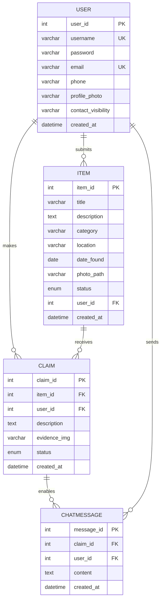

# Where's My Pie? 🥧
A simple and accessible lost and found system for everyone

**Development Team: TreeNoPie**

## Project Overview

Where's My Pie? is a lost and found system designed for campus communities. It facilitates the process of reporting found items and claiming lost belongings through a two-way verification mechanism.

### 🎯 Core Features
- User account management with secure authentication
- Found item reporting with photo upload
- Advanced item search and filtering by categories
- Secure claim request system with evidence upload
- Private messaging after successful claims
- Customizable contact visibility settings
- User profile management
- Dashboard for managing items and claims

## System Architecture

### Technology Stack
- Frontend: HTML5, CSS3, JavaScript
- Backend: PHP 7.4+
- Database: MariaDB 10.3+
- Web Server: Apache2
- Platform: Raspberry Pi Zero 2W

### Database Design



### Item Categories
- Food
- Electronics
- Cards & IDs
- Wallets & Cash
- Keys
- Clothing & Accessories
- Bags
- Personal Items
- Sports Equipment
- Others

### Database Tables

| Table       | Description                  | Key Relations                  |
|-------------|------------------------------|-------------------------------|
| User        | Account information         | Primary table                 |
| Item        | Found item details          | References User               |
| Claim       | Claim request records       | References User and Item      |
| ChatMessage | Communication logs          | References Claim and User     |

The following tables implement the entities shown in the ER diagram above.

## Usage Workflows

### Found Item Reporting
1. Login to your account
2. Click "Report Found Item"
3. Fill in item details and category
4. Upload item photo (optional)
5. Submit the form

### Lost Item Claiming
1. Search items by keyword or category
2. Submit claim with description
3. Upload evidence photo (optional)
4. Wait for finder's review
5. When approved, chat with finder

### Profile Management
1. Update contact information
2. Set contact visibility preferences
3. Change password
4. Upload profile photo

## Quick Setup

### Requirements
- Raspberry Pi Zero 2W
- 16GB microSD card
- Raspberry Pi OS
- Internet connection

### Basic Installation
```bash
# Clone repository
git clone [repo-url] /var/www/html/WheresMyPie

# Setup database
mysql -u root -p < sql/schema.sql

# Configure application
cp includes/config.php.example includes/config.php
# Edit config.php with your settings

# Set permissions
sudo chown -R www-data:www-data /var/www/html/WheresMyPie
sudo chmod -R 755 /var/www/html/WheresMyPie
```

Detailed instructions in [Installation.md](Installation.md)

## 📁 Project Structure
```
WheresMyPie/
├── public_html/          # Web root directory
│   ├── auth/            # Authentication (login, register, reset password)
│   ├── items/           # Item management and search
│   ├── claims/          # Claim request and review
│   ├── user/            # Profile management and dashboard
│   ├── chat/            # Private messaging system
│   ├── errors/          # Error pages
│   ├── assets/          # Static resources
│   │   ├── css/        # Stylesheets
│   │   ├── js/         # JavaScript files
│   │   └── images/     # Image resources
│   ├── uploads/        # User uploaded files
│   │   ├── items/      # Item photos
│   │   ├── evidence/   # Claim evidence
│   │   └── profiles/   # Profile photos
│   └── includes/       # Core PHP components
├── sql/                # Database schema and migrations
├── private/           # Server-side only files
│   └── logs/         # Application logs
└── doc/               # Documentation files
```

## 🔒 Security Features
- Secure password hashing with PHP's password_hash()
- PDO prepared statements for SQL injection prevention
- Input sanitization and output escaping
- Secure file upload handling with type verification
- User data privacy with configurable visibility settings
- Session-based authentication
- Protected upload directories
- Custom error handling

## 📚 Documentation
- [Installation Guide](Installation.md)
- [User Manual](UserGuide.md)
- [Admin Guide](AdminGuide.md)
- [Team Members](Contributors.md)

## 📄 License
This project is for educational and non-commercial use. See the repository for details.

---
*Building a better lost and found community together* 🌟