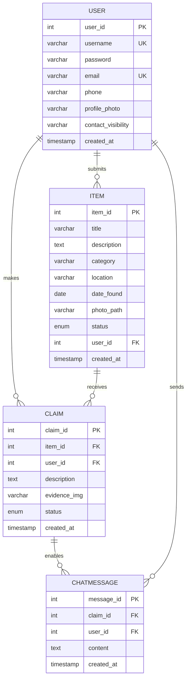

# Project Specification for "Where's My Pie?"
A public lost-and-found platform where users can report found items, search for lost belongings, and communicate with others to return items to rightful owners.

## 1. Demo Scenario Overview

### Features to Demonstrate

- User registration and login.
- Finder can submit a form to report a found item.
- Users can browse or search lost items using filters (e.g., category, date, location).
- Claimers can fill out a claim form with supporting evidence.
- Finders can review incoming claims and approve one.
- Upon approval, both parties gain access to each other's contact info.
- A simple chat system allows communication after approval.
- Users can edit their account information.

### Demo User Actions

- A user logs in and reports a found item with a photo.
- Another user logs in, searches for that item, and submits a claim.
- The original finder sees the claim and approves it.
- Both users see each other's contact info and may exchange chat messages.
- A user updates their profile information.

### Functional Parts of the Application

We will implement the following:

- Form submission and backend processing with PHP.
- Data storage and retrieval using MariaDB.
- Dynamic rendering of item lists and claim forms.
- Account login, session handling, and basic profile update.
- Basic chat functionality.

The admin interface has been removed for simplicity; instead, finders will directly approve or reject claims to their reported items.

---

## 2. Planned URL Endpoints

| URL Path              | Method | HTTP Variables                  | Session Variables      | DB Operations                        |
|-----------------------|--------|----------------------------------|-------------------------|---------------------------------------|
| /index.php            | GET    | —                                | user_id (optional)      | fetch recent items                    |
| /login.php            | POST   | username, password               | sets user_id            | check user credentials                |
| /register.php         | POST   | name, password, phone            | sets user_id            | insert new user                       |
| /logout.php           | GET    | —                                | destroys session        | —                                     |
| /submit_item.php      | POST   | title, description, tags, photo  | requires user_id        | insert item into database             |
| /search.php           | GET    | keyword, category, date, place   | user_id (optional)      | search items                          |
| /claim_item.php       | POST   | item_id, explanation, photo      | requires user_id        | insert claim                          |
| /my_claims.php        | GET    | —                                | requires user_id        | fetch claims made                     |
| /review_claims.php    | GET    | item_id                          | requires user_id        | fetch claims for this item            |
| /approve_claim.php    | POST   | claim_id                         | requires user_id        | update claim status                   |
| /chat.php             | POST   | claim_id, message                | requires user_id        | insert chat message                   |
| /account.php          | GET    | —                                | requires user_id        | fetch user details                    |
| /update_account.php   | POST   | name, password, phone            | requires user_id        | update user info                      |

---

## 3. Database Design

### a. Entity-Relationship Diagram (ERD)

#### Key Relationships

- **User–Item (1:M):** A user (finder) can submit multiple items.
- **User–Claim (1:M):** A user (claimer) can make multiple claims.
- **Item–Claim (1:M):** One item can have multiple claims, but only one can be approved.
- **Claim–ChatMessage (1:M):** Each approved claim enables a chat thread.
- **User–ChatMessage (1:M):** Users send messages in chat threads.

### b. Relational Model

#### User

| Column            | Type         | Key         |
|------------------|--------------|-------------|
| user_id          | INT, AUTO PK | PK          |
| username         | VARCHAR(50)  | UNIQUE      |
| password         | VARCHAR(255) |             |
| email            | VARCHAR(100) | UNIQUE      |
| phone            | VARCHAR(20)  |             |
| profile_photo    | VARCHAR(255) |             |
| contact_visibility| VARCHAR(10)  |             |
| created_at       | TIMESTAMP    |             |

#### Item

| Column       | Type         | Key         |
|--------------|--------------|-------------|
| item_id      | INT, AUTO PK | PK          |
| title        | VARCHAR(100) |             |
| description  | TEXT         |             |
| category     | VARCHAR(50)  |             |
| location     | VARCHAR(100) |             |
| date_found   | DATE         |             |
| photo_path   | VARCHAR(255) |             |
| status       | ENUM         | available, claimed |
| user_id      | INT          | FK → User   |
| created_at   | TIMESTAMP    |             |

#### Claim

| Column       | Type         | Key         |
|--------------|--------------|-------------|
| claim_id     | INT, AUTO PK | PK          |
| item_id      | INT          | FK → Item   |
| user_id      | INT          | FK → User   |
| description  | TEXT         |             |
| evidence_img | VARCHAR(255) |             |
| status       | ENUM         | pending, approved, rejected |
| created_at   | TIMESTAMP    |             |

#### ChatMessage

| Column       | Type         | Key         |
|--------------|--------------|-------------|
| message_id   | INT, AUTO PK | PK          |
| claim_id     | INT          | FK → Claim  |
| user_id      | INT          | FK → User   |
| content      | TEXT         |             |
| created_at   | TIMESTAMP    |             |

### c. Normalization (3NF Justification)

**First Normal Form (1NF):**
- All tables contain atomic values (no multi-valued attributes).
- Each column contains values of a single type.
- All entries in a column are of the same kind.

**Second Normal Form (2NF):**
- Meets 1NF requirements.
- No partial dependencies exist (all non-key attributes fully depend on the primary key).
- Each table has a single-column primary key, eliminating partial dependency issues.

**Third Normal Form (3NF):**
- Meets 2NF requirements.
- No transitive dependencies exist:
  - User information is stored only in the User table, not repeated in Item or Claim tables.
  - Item details are stored only in the Item table.
  - Claim information is stored only in the Claim table.
  - Chat messages reference users and claims through foreign keys, not by storing redundant data.

**Additional Design Decisions:**
- Foreign key constraints ensure referential integrity.
- Unique constraints prevent duplicate usernames and multiple claims per user per item.
- Proper indexing on foreign keys improves query performance.
- Default values and timestamps provide audit trails.
- CASCADE deletion maintains data consistency when parent records are removed.